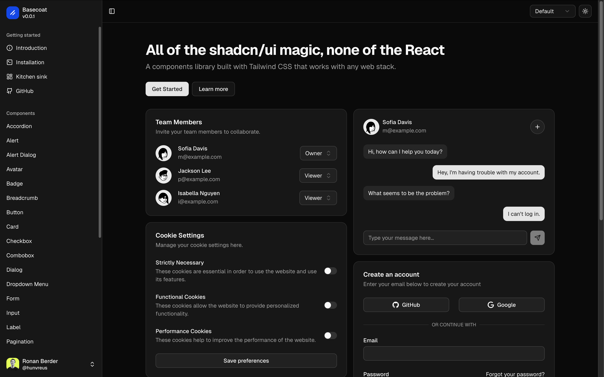

# Basecoat

Basecoat is a Tailwind CSS, vanilla HTML/CSS/JavaScript implementation of the shadcn/ui design system. It provides shadcn-style components for any web stack without React, Radix, or framework runtime dependencies.



## Features

- Semantic HTML-first components.
- Tailwind CSS v4 source files and generated CSS bundles.
- Small vanilla JavaScript for components that need behavior.
- Nunjucks and Jinja template macros.
- Standalone style packs: Vega, Nova, Maia, Lyra, Mira, Luma, Sera, and Rhea.
- Dark mode and CSS variable theming.
- CDN, npm, and CLI usage paths.

## Documentation

- Website: [basecoatui.com](https://basecoatui.com)
- Installation: [basecoatui.com/installation](https://basecoatui.com/installation)
- Customization: [basecoatui.com/customization](https://basecoatui.com/customization)

## Packages

This repository publishes two workspace packages:

- `basecoat-css`: CSS, JavaScript, Nunjucks macros, and Jinja macros.
- `basecoat-cli`: CLI for adding Basecoat assets to a project.

Package details live in:

- `packages/css/README.md`
- `packages/cli/README.md`

## Install

```bash
npm install basecoat-css
```

Use the default bundle:

```css
@import "tailwindcss";
@import "basecoat-css";
```

Use a specific style bundle:

```css
@import "tailwindcss";
@import "basecoat-css/nova";
```

Use the styleless base plus a custom style file:

```css
@import "tailwindcss";
@import "basecoat-css/base";
@import "./style-acme.css";
```

## Repository Layout

```text
.
├── docs/
│   ├── generated/        Generated RSD/Astro docs input
│   └── src/              Documentation source pages, examples, and fragments
├── packages/
│   ├── cli/              Published CLI package
│   └── css/              Published CSS package
├── public/               Generated docs assets for Astro
├── scripts/              Build and generation scripts
└── src/
    ├── components/       Astro overrides for ReallySimpleDocs
    ├── css/
    │   ├── base/         Shared tokens, base layer, and semantic utilities
    │   ├── components/   Component structure and behavior hooks
    │   └── styles/       Style-pack visual rules
    ├── docs.css          Documentation-site CSS extension
    ├── jinja/            Jinja component macros
    ├── js/               Vanilla JS components and registry
    └── nunjucks/         Nunjucks component macros
```

## CSS Architecture

Basecoat separates structure from style:

- `src/css/base/base.css`: shared tokens and semantic utilities.
- `src/css/components/*.css`: component layout, structure, accessibility selectors, and behavior hooks.
- `src/css/styles/*.css`: style-pack visuals such as color, radius, shadow, typography, spacing, variants, and state styles.

Generated source entrypoints are committed for transparency and package imports:

- `src/css/basecoat.css`: default backward-compatible Vega bundle.
- `src/css/basecoat-base.css`: base plus components, no style pack.
- `src/css/basecoat-components.css`: component imports only.
- `src/css/basecoat-<style>.css`: base plus one style pack.
- `src/css/basecoat-<style>.cdn.css`: CDN-compatible wrapper.

These entrypoints are generated by `scripts/generate-css-entrypoints.js` and by the build scripts.

## JavaScript Lifecycle

- `window.basecoat.init(name)` initializes uninitialized components for one registered component.
- `window.basecoat.initAll()` initializes all uninitialized registered components.
- `window.basecoat.refresh(element)` asks an initialized component to rescan dynamic children when it supports refresh.
- Components use internal destroy hooks to clean up listeners when initialized roots are removed from the DOM.

## Development

```bash
# Install dependencies.
npm i

# Generate docs input and run the ReallySimpleDocs/Astro site.
npm run docs:dev

# Build package assets.
npm run build

# Build the static docs site.
npm run docs:build

# Run the Workers docs site locally.
npm run workers:dev

# Deploy the Workers docs site.
npm run workers:deploy
```

## License

[MIT](LICENSE.md)
